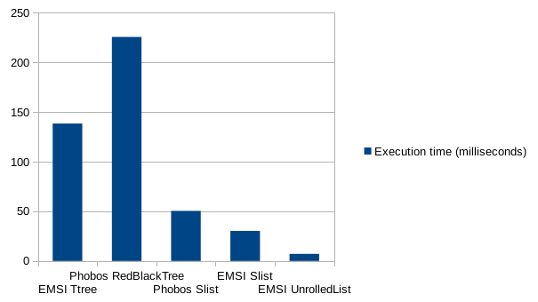

Containers [](https://travis-ci.org/dlang-community/containers/)
==========

Containers backed by std.experimental.allocator

# Dependencies
Run `git submodule update --init --recursive` after cloning this repository.

# Documentation
Documentation is available at http://dlang-community.github.io/containers/index.html

# Example

```d
/+dub.sdl:
dependency "emsi_containers" version="~>0.6"
+/
import std.stdio;
void main(string[] args)
{
    import containers;
    DynamicArray!int arr;
    arr ~= 1;
    foreach (e; arr)
        e.writeln;
}
```

[](https://run.dlang.io/is/8GYopZ)

# Insertion Speed Benchmark


Measurements taken on a `Intel(R) Core(TM) i5-4250U CPU @ 1.30GHz` with 8GB of memory.
Compiled with dmd-2.068.0 using `-O -release -inline` flags.

### Code

```d
import containers.ttree;
import std.container.rbtree;
import containers.slist;
import std.container.slist;
import containers.unrolledlist;
import std.experimental.allocator;
import std.experimental.allocator.building_blocks.allocator_list;
import std.experimental.allocator.building_blocks.region;
import std.experimental.allocator.mallocator;
import std.datetime;
import std.stdio;

// For fun: change this number and watch the effect it has on the execution time
alias Allocator = AllocatorList!(a => Region!Mallocator(1024 * 16), Mallocator);

enum NUMBER_OF_ITEMS = 500_000;

void testEMSIContainer(alias Container, string ContainerName)()
{
	Allocator allocator;
	auto c = Container!(int, typeof(&allocator))(&allocator);
	StopWatch sw = StopWatch(AutoStart.yes);
	foreach (i; 0 .. NUMBER_OF_ITEMS)
		c.insert(i);
	sw.stop();
	writeln("Inserts for ", ContainerName, " finished in ",
		sw.peek().to!("msecs", float), " milliseconds.");
}

void testPhobosContainer(alias Container, string ContainerName)()
{
	static if (is(Container!int == class))
		auto c = new Container!int();
	else
		Container!int c;
	StopWatch sw = StopWatch(AutoStart.yes);
	foreach (i; 0 .. NUMBER_OF_ITEMS)
		c.insert(i);
	sw.stop();
	writeln("Inserts for ", ContainerName, " finished in ",
		sw.peek().to!("msecs", float), " milliseconds.");
}

void main()
{
	testEMSIContainer!(TTree, "TTree")();
	testPhobosContainer!(RedBlackTree, "RedBlackTree")();

	testPhobosContainer!(std.container.slist.SList, "Phobos SList")();
	testEMSIContainer!(containers.slist.SList, "EMSI SList")();

	testEMSIContainer!(UnrolledList, "UnrolledList")();
}
```
